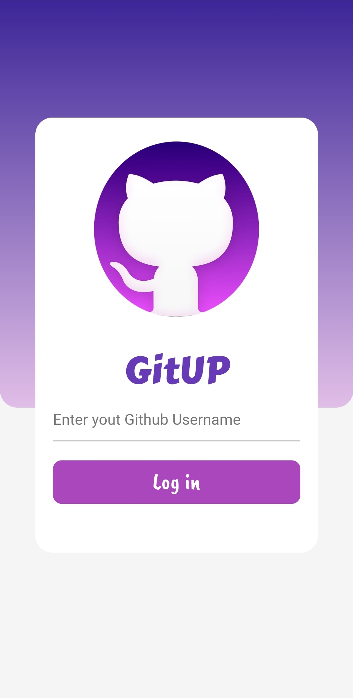
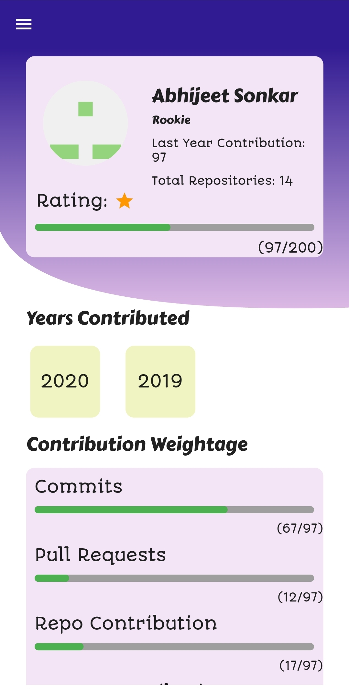
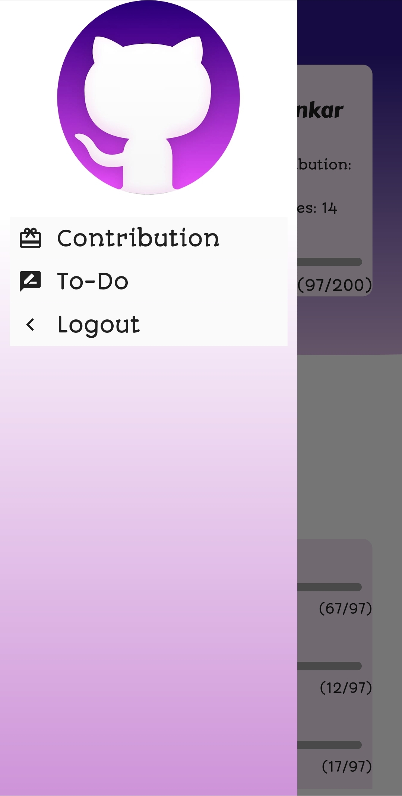
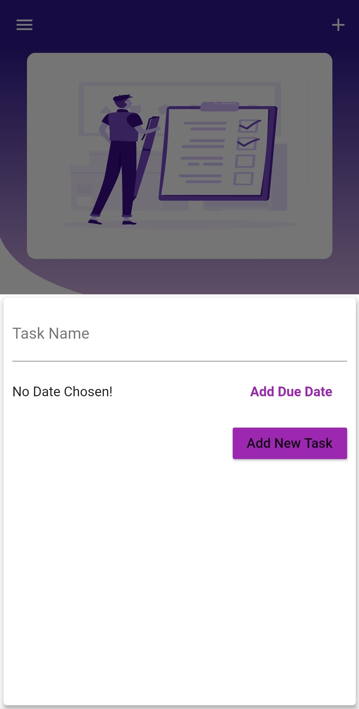
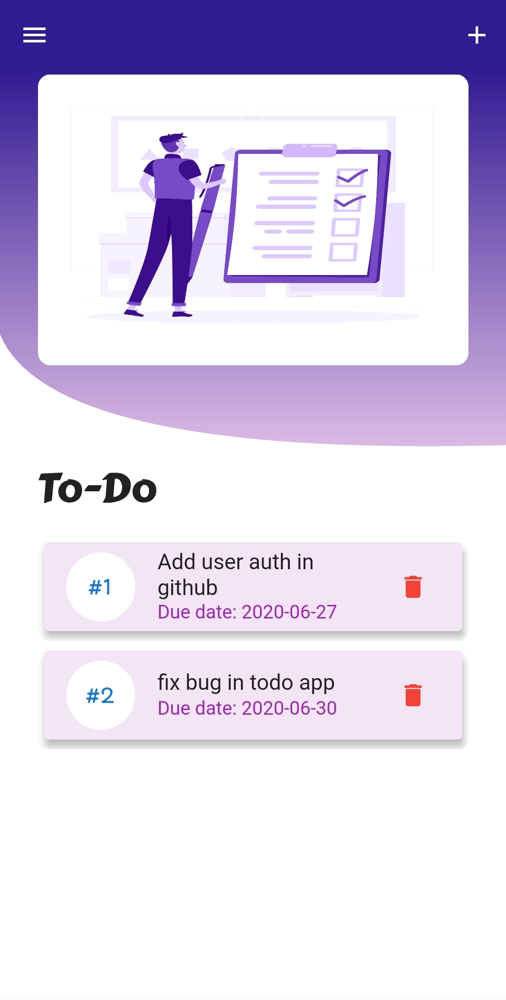

# GitUP

An app made with flutter to view your Github Contributions and add to-do's to manage your task on Github.
- The rating in Contribution screen is based on your Github contribution in last year.
- Contribution lower than 200  gets one star ,contribution below 400 gets 2 star and so on and anything above 1200 gets 7 star.
- The logged-in username is stored via shared preferences.
- Data from To-do screen is stored in local storage via sqflite.

## Packages Used
| Packages  | Version |
| ------ | ------ |
|flutter_bloc |  ^ 4.0.1 |
|  graphql_flutter: | ^ 3.0.1  |
| google_fonts | ^ 1.1.0  |
|shared_preferences |  ^ 0.5.7+3  |
|  path|^1.6.4  |
|flutter_bloc | ^ 4.0.1|
|flutter_launcher_icons| ^  0.7.2|

##Apk

## API used
https://api.github.com/graphql

Note :- To use Github's GraphQL API first you need  to generate an Access Token
- Go to Settings->Developer Settings->Personal Access Token ->Generate Token

To use the Token in GitUP 
- Simply goto GitUP/lib/access_token.dart 
- Replace 'Enter your access token' with your own generated access token.

## Screenshots

